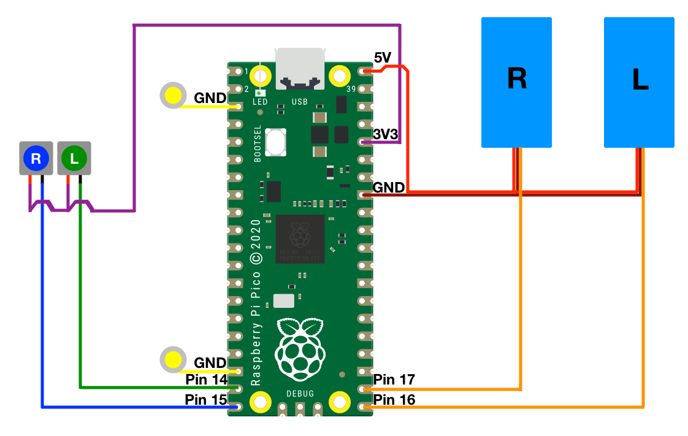

# Kindle Page Turner

**Documentation still ongoing, but all required files are in the repo**

The code in this repository, along with the physical components outlined in the [bill of materials](#Bill-of-Materials), can be used to turn pages of a Kindle e-reader with external buttons.

I made this project to allow me to more comfortably read books, something I struggle with as a result of chronic pain. I use my hands, in a relaxed position, to press the buttons. However, one could use longer wires and potentially press the buttons with their feet to avoid using arms at all.

This project allows the user to turn pages on a Kindle using external buttons, when the kindle is in a stand.
Navigating the user interface of the Kindle is outside the capabilities of this project.

## Instructions
These instructions will serve as a rough guide of the steps required to make this project.
The project, as it stands, requires off-the-shelf electronic components, custom 3D printed pieces, and relatively simple soldering.

### Hardware
The [tools](#Tools) and [materials](#Bill-of-Materials) will be used to assemble the final product, shown above. If you have acquired the items required, you can follow the steps outlined in the [assembly](#Pre-Assembly) section.

#### Tools
- Soldering Iron
- Solder Wire
- 3D Printer/ 3D Printing Service/ or some means of mimicking [the case and parts](./stls/) listed below
- Scissors/ wire cutter
- **Optional:** wire stripper

#### Bill of Materials
Item # | Quantity | Part # | Part Name                                                                         | Description
------:|---------:|-------:|:----------------------------------------------------------------------------------|-------------
1      | 1        | G0910  | [Kindle](https://www.amazon.co.uk/dp/B07FQ4XCR1)                                  | The 10th Generation Kindle e-reader
2      | 1        | N/A    | [kindle_holder_and_servo_housing.stl](./stls/kindle_holder_and_servo_housing.stl) | A case for the Kindle
3      | 1        | N/A    | [pico_housing.stl](./stls/pico_housing.stl)                                       | The housing for the Raspberry Pi Pico at the back of the case
4      | 1        | N/A    | [pico_cover.stl](./stls/pico_cover.stl)                                           | A cover for the Raspberry Pi Pico Housing, to keep wires contained
5      | 1        | N/A    | [servo_horn_sheaths.stl](./stls/servo_horn_sheaths.stl)                           | For attaching stylus tips pads to the servo motors
6      | 2        | N/A    | [Stylus Pen Tips](https://www.ebay.ie/itm/174215638532)                           | Capacitive stylus tips for the touch screen
7      | 2        | SG90   | [SG90 Servo Motor](https://www.ebay.ie/itm/373323581713)                          | Servo motors for moving the stylus tips
8      | 1        | SCO915 | [Raspberry Pi Pico](https://www.raspberrypi.org/products/raspberry-pi-pico/)      | Raspberry Pi Pico Microcontroller
9      | 1        | N/A    | Micro-USB cable                                                                   | A power cable for the Raspberry Pi Pico
10     | 1        | N/A    | [Tablet holder](https://www.amazon.co.uk/gp/product/B074GNPSC7/)                  | **Optional:** Tablet holder for positioning the kindle at a comfortable height hands-free
11     | 6        | N/A    | [Wires](https://www.ebay.ie/itm/232901601951)                                     | Lengths of wire, to your preference (I used over 4 m of wire)
12     | 2        | N/A    | [Buttons](https://www.ebay.ie/itm/224192810260) or [Key Switches](https://splitkb.com/collections/switches-and-keycaps) | Buttons or Switches to push when wanting to turn the page on the Kindle — I use light-weight low-profile choc switches

#### 3D Printing
I recommend 3D printing the stl files at the following settings:
Setting         | Value
----------------|------
Filament        | PLA or similar
Nozzle Diameter | 0.4 mm or smaller
Layer Height    | 0.2 mm or less
Infill          | 20% or more
Supports        | Off

#### Pre-Assembly
1. Place the servo motors into their respective housings, on the left and right sides of the Kindle housing, with their wires through the holes at the back. If the servos have connectors at the end of the wires, cut the connectors off before separating the wires by ~7 cm and stripping the ends.
2. Solder the button pins, that are connected when the button is pressed, to lengths of wire that are long enough to reach a desk or lap from where the Kindle will be used. I used 1m of wire to each button pin I was connecting.
3. To avoid the wires tangling, it is recommended that you twist, or secure at regular intervals, the wires used for the buttons.

We'll complete the assembly after dealing with the circuitry portion.

#### Circuit
In this section, we'll solder the circuit to match the following diagram:

- The buttons register a click when 3.3 V reaches their respective pins. The buttons are illustrated on the left side of the diagram.
- The stylus tips must be grounded for the Kindle to detect their taps. These are shown as the yellow lines and circles to the left of the Pico.
- The servos require 5 V to their red wires, their brown wires to be grounded, and their orange wires connected to the pins labelled on the right of the controller.

Use the [soldering tools](#Tools) to create mechanical and electrical connections between the components, as shown in the diagram.

#### Assembly
With the circuit ready, complete the following steps:
1. Feed the grounded wires through the servo horn sheaths. Make a connection here to the stylus tip, so that the tips will be grounded by the wires.
2. Secure the horns to the servos so that the end of their range will allow the stylus tip to reach the screen.
3. Put the servo horn sheaths, with wires and stylus tips attached, onto the servo horn.
4. Tidy the circuit into the Pico housing.
5. Slip the Pico Housing into the back of the Kindle case.
6. Cover the Pico and wiring with the housing cover.

At this point we will load the software onto the Pico.

### Software
I recommend following [this article](https://www.twilio.com/blog/programming-raspberry-pi-pico-microcontroller-micropython) on how to install micropython and transfer files onto the Raspberry Pi Pico.
If you copy [main.py](./main.py) onto the Raspberry Pi Pico, after installing micropython and setting up the hardware, it should allow buttons to turn the pages of the kindle.

### Testing
Once the software is loaded, and the Pico restarted, try pressing the buttons to see if the servos move as expected.
If they do not, review the previous steps to resolve your issue.

It is recommended not to have your Kindle in the case when first testing, should the servos try to rotate past the screen.
If the rotation is off, reattach the servo horns to a better angle and try again.

